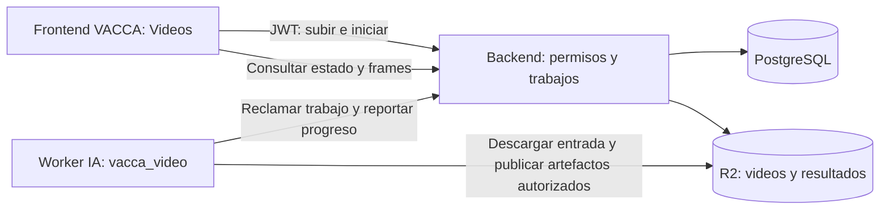

# Revisión de integración de video en VACCA

Fecha: 2026-10-01. Revisión de código y referencias remotas; no es una prueba del despliegue.

## Conclusión

El procesador de video es reutilizable, pero todavía no está integrado en VACCA.
La entrada del producto debe ser una pantalla del frontend React, autenticada
contra el backend existente. Este administra archivos, permisos y trabajos;
un proceso de IA ejecuta `vacca_video` y devuelve resultados versionados.

La revisión encontró incompatibilidades concretas que impiden resolverlo
simplemente agregando un botón a una página HTML. La más relevante es que los
permisos de videos y evidencias todavía dependen de RFID y evaluaciones BCS.
También hay reglas de sesiones que no encajan con una sesión dedicada a video.

## 1. Estado comprobado

Se ejecutó `git fetch origin` exitosamente en backend, frontend e IA, sin pull,
merge ni cambios de rama. Las referencias consultadas no cambiaron respecto
de las que estaban disponibles al comenzar esta revisión.

| Repositorio | Checkout local | origin/main | origin/develop |
| --- | --- | --- | --- |
| backend | main | 3707417 | 1bb067e |
| frontend | main | 890c7df | b472452 |
| IA | main | 2d8b5ea | 2024ec9 |
| IA-video, worktree del mismo repositorio IA | feature/deteccion-video, 6ab2116 | comparte las referencias de IA | basado en 2024ec9 |

El backend tiene el informe anterior sin seguimiento. IA-video conserva cambios
sin commit en `docs/video-prototype.md` y los archivos nuevos `Abrir VACCA.vbs`
y `scripts/video_gui.py`. Esta revisión los preserva. El commit del procesador
está un commit por delante de origin/develop; no se publicó la rama.

Frontend develop contiene cambios de validación de fotos, indicadores de vacas
preñadas y ajustes de UI. Backend develop incluye recomendaciones y cambios de
servicios, con sus migraciones. Frontend main ya consume recomendaciones que
backend main no expone. Por ello no conviene probar la integración combinando
arbitrariamente los tres checkouts main.

Recomendación: preparar los cambios nuevos sobre origin/develop de cada repo,
fijar los SHA usados en una guía de ejecución conjunta y coordinar PRs hacia
develop. Es una recomendación basada en las ramas observadas, no una política
de publicación confirmada por el equipo.

## 2. Qué interfaces existen realmente

Hay tres interfaces de prueba distintas, además del frontend del producto:

| Interfaz | Función actual | Lugar en la integración |
| --- | --- | --- |
| `src/vacca_api/static/index.html`, servido en `/ui` | Validación de imágenes para detección y BCS | Herramienta interna de IA; el código la identifica como prototipo |
| `src/vacca_video/report.html`, copiado a cada salida | Explorar frames y resultados ya procesados | Evidencia portable y herramienta de revisión |
| `scripts/video_gui.py`, abierto por el VBS | Ejecutar el CLI local mediante botones | Utilidad de desarrollo en Windows |
| frontend React | Login, animales, sesiones, servicios y recomendaciones | Entrada definitiva del usuario |

La página `index.html` de IA y el `report.html` del video no son la misma página.
Modificar solo cualquiera de ellas no integra la funcionalidad con login,
persistencia y permisos del frontend. El VBS tampoco debe convertirse en un
requisito de uso del producto.

## 3. Hallazgos que afectan la integración

### A. Hay CRUD de videos, pero no procesamiento

En backend, `app/routers/captura/video.py` registra metadatos JSON bajo
`/api/videos/`. No recibe un MP4, no extrae frames ni crea trabajos de IA.
`app/models/captura.py` ya define Video, EvidenciaVisual, tipo FRAME y origen VIDEO.
Son bases útiles, no una implementación terminada de la release.

`app/services/storage.py` sube JPEG/PNG a R2 y genera URLs firmadas de lectura.
Hay que agregar subida de video con límites y validación, sin cargar el archivo
completo en RAM. Persistir storage_key; las URLs temporales se generan al leer.

### B. La autorización de videos no coincide con la de sesiones

En `app/auth/ownership.py`, tanto main como develop:

- Las sesiones se leen por `SesionCaptura.usuario_id`.
- Los videos se leen a través de una sesión con lectura RFID de un animal de un
  lote administrado por el usuario.
- Crear un video verifica acceso a la sesión, pero la lectura posterior usa la
  condición RFID anterior.

Consecuencia deducida del código: un usuario normal puede crear un video en su
sesión sin RFID y no encontrarlo al consultarlo. El superusuario evita ese filtro,
por lo que una demo hecha exclusivamente como administrador puede ocultar el problema.

### C. Frames sin evaluación tampoco tienen un acceso adecuado

Los filtros de EvidenciaVisual e Inferencia hacen joins por EvaluacionCC y Animal.
Un frame asociado solo a video no cumple ese recorrido. Se requiere autorización
por video para evidencias de origen VIDEO, manteniendo intacta la autorización de
las imágenes de evaluaciones. Si se permite asociar ambas referencias, validar
consistencia y evitar que una referencia autorizada exponga contenido de otra.

### D. Las sesiones actuales son sesiones de evaluación

El router permite una sola sesión abierta por usuario y rechaza cerrar una
sesión sin evaluaciones. `SesionDetailPage.tsx` muestra evaluaciones, dashboard
de CC y recomendaciones. Crear automáticamente una sesión por video entraría en
conflicto con esas reglas.

Por eso recomiendo una pantalla **Videos** independiente dentro del mismo
AppLayout, con asociación opcional a una sesión existente. Esto mantiene la
funcionalidad dentro de VACCA sin forzar cambios al trabajo de evaluaciones.

### E. Detección no es condición corporal

`app/models/inferencia.py` exige `valor_estimado` entre 1 y 5: representa CC.
No debe guardar el número de vacas en ese campo.
El flujo de fotos en `app/routers/evaluacion.py` llama a `/detect` con umbral
0.80, luego `/bcs`, y actualiza la evaluación. No sirve como flujo de video.
La API de IA recibe imágenes; no expone un trabajo de video en las ramas revisadas.

El procesador `vacca_video` usa solo detección. Sus cajas y cantidades por frame
no identifican animales, no asignan RFID y no generan evaluaciones BCS.

### F. No hay una cola duradera de video

El compose revisado del backend levanta PostgreSQL. No incluye un worker de
video ni un broker. Los estados actuales de Video son PENDIENTE, PROCESADO y
ERROR; falta el ciclo de ejecución, progreso, recuperación y reintentos.
La API IA tiene un límite de concurrencia para detección, pero ese límite no es
una cola de trabajos ni coordina procesos independientes.

### G. Lo aprovechable del prototipo

`vacca_video` ya separa fuente, muestreo, detector y salida. Procesa de forma
incremental y produce timestamps, cajas, confianza, versión/hash de modelo,
JSONL y resumen. Es la base del worker; no hace falta reescribir YOLO.

`PresentationSink` escribe archivos locales. Para integrar hay que agregar un
destino de resultados que publique artefactos e informe progreso al backend.
El HTML usa previews acotadas; no representa por sí solo una API paginada.
El MP4 actual usa mp4v, cuya reproducción en navegadores no está garantizada:
el primer visor integrado puede usar imágenes por frame, como el reporte actual.

## 4. Arquitectura propuesta, todavía no implementada

Para el primer corte recomiendo un worker de IA y trabajos persistidos en el
PostgreSQL existente. El worker reclama tareas mediante endpoints internos
autenticados del backend; no accede directamente a las tablas del negocio.
El backend reclama atómicamente y entrega un lease con vencimiento. Heartbeat,
identificador de intento y finalización condicionada al lease impiden que un
worker viejo sobrescriba un reintento. Un reinicio recupera tareas vencidas.

Esto requiere código nuevo; no existe hoy. Evita introducir Redis/Celery solo
para la primera demo y permite sumar workers después conservando el contrato
público. Un broker puede incorporarse cuando el volumen lo justifique.
Un thread de FastAPI sin persistencia no debe presentarse como equivalente.

IA y backend mantienen sus dependencias separadas. El navegador no llama
directamente a la IA ni recibe credenciales del worker. La primera configuración
usa concurrencia uno y cuotas para evitar competir sin control con imágenes/BCS.

## 5. Datos y contrato mínimo propuesto

Agregar propietario explícito a Video para videos nuevos, establecido por el
backend desde el JWT, no desde el cuerpo enviado por el cliente. Mantener
sesion_id opcional y comprobar acceso si se adjunta una sesión. La migración debe
resolver registros existentes: rellenar propietario desde la sesión cuando sea
posible y dejar casos sin dueño para revisión administrativa. Antes de reemplazar
reglas RFID, probar los accesos compartidos existentes para no revocarlos o
ampliarlos accidentalmente.

Agregar AnalisisVideo con video_id, usuario solicitante, estado, configuración,
versión del contrato, identificador de intento, fechas UTC, lease, heartbeat,
progreso, motivo de finalización, error resumido y referencias a artefactos.
Separar los estados del análisis de EstadoVideo reduce cambios en consumidores
actuales y permite volver a analizar el mismo video con otra configuración.

Estados propuestos: PENDIENTE → PROCESANDO → COMPLETADO o ERROR.
Un límite de frames alcanzado se informa explícitamente como resultado parcial;
no se presenta como procesamiento de todo el archivo.

| Operación propuesta | Resultado |
| --- | --- |
| POST `/api/videos/subir` con multipart y sesión opcional | 201, registro de video propio y archivo validado |
| POST `/api/videos/{id}/analisis` | 202, identificador de trabajo persistido; clave de idempotencia |
| GET `/api/videos/{id}/analisis` | Historial autorizado de análisis |
| GET `/api/analisis-video/{id}` | Estado, progreso, configuración, métricas y error |
| GET `/api/analisis-video/{id}/frames?cursor=...&limit=...` | Frames paginados, timestamp, cajas, confianza y URL temporal |

Estas rutas son diseño, no endpoints disponibles. Registrar `/subir` antes de
`/{video_id}` en el router. Mantener el CRUD actual para consumidores existentes;
los nuevos estados de trabajo solo los modifica el backend/worker autorizado.

Reutilizar `vacca-video-frame-v1` como punto de partida y conservar timestamp_ms,
dimensiones originales, coordenadas y definición del conteo. Persistir resultados
por frame o en bloques indexados; no leer un JSONL completo en cada petición de
página. Los artefactos de un intento se publican antes de marcarlo completado.

## 6. Cambios concretos por repositorio

| Repo | Cambio acotado |
| --- | --- |
| frontend | `features/videos`, páginas `/videos` y `/videos/:id`, enlace en navegación, servicios con el httpClient y JWT existentes |
| backend | Migración de propietario y trabajos, rutas de subida/análisis, autorización de videos/frames y servicio de archivos de video |
| IA | Worker que reutiliza `process_frames`, adaptador de resultados y progreso, sin modificar el contrato de `/detect` ni `/bcs` |

En frontend reutilizar ProtectedRoute, AppLayout, Chakra, notificaciones y
`postFormData`. Consultar estado cada pocos segundos, detener consultas al salir
y descartar respuestas de un análisis anterior. La recarga del navegador debe
recuperar el trabajo por ID. Al principio mostrar frame anotado y timestamp juntos;
superponer cajas muestreadas sobre un video continuo requiere sincronización extra.

No hace falta agregar otra aplicación web al costado ni incrustar el HTML local
en un iframe. Se reutilizan sus datos y comportamiento visual dentro de React.

## 7. Orden de entrega y coordinación

1. PR de backend: contrato, migración, permisos y persistencia. Verificar usuarios
   normales y datos existentes antes de construir la pantalla sobre esos permisos.
2. PR de IA: worker con el procesador actual y resultados versionados.
3. PR de frontend: pantalla Videos detrás de una opción de habilitación; controlar
   también disponibilidad en backend. Activar cuando los componentes sean compatibles.
4. Guía de ejecución conjunta con versiones exactas, configuración y video real.

Usar worktrees nuevos para backend y frontend basados en origin/develop y conservar
IA-video para el procesador. El mismo nombre de rama en repos distintos no los
sincroniza: cada PR necesita su dependencia y versión de contrato declaradas.
Actualizar las ramas periódicamente; resolver divergencias en la rama de trabajo.
Revisar el head de Alembic antes de publicar para evitar dos migraciones finales
incompatibles. No cambiar el main de los compañeros para ejecutar esta demo.

La complejidad es media a alta para la integración completa: detección y extracción
ya existen, pero permisos, almacenamiento y trabajos recuperables son trabajo real.
Un botón local es pequeño; una entrega integrada y persistente no se limita al botón.

## 8. Criterios de aceptación

- Usuario A sube un MP4 real y consulta resultados; usuario B no puede leerlos,
  descargarlos ni iniciar procesos sobre ese video.
- Video sin RFID y sin BCS funciona; no crea animales o evaluaciones ficticias.
- Reiniciar el navegador conserva el trabajo; reiniciar el worker no deja tareas
  eternamente procesando. Repetir una solicitud no duplica un trabajo accidentalmente.
- Video corrupto, exceso de tamaño/duración y fallo de storage generan errores
  recuperables con limpieza de temporales; validar contenido, no solo extensión.
- Limitar espacio, duración, resolución y concurrencia; renovar URLs cuando vencen.
- Conteo y cajas corresponden al mismo frame, con timestamps ordenados y límites
  explícitos. No sumar detecciones de frames para afirmar animales únicos.
- Flujos de fotos, BCS, sesiones y recomendaciones siguen pasando sus pruebas.
- Pruebas del contrato worker/backend, migración, aislamiento entre usuarios,
  recuperación de intentos y recorrido real desde la pantalla hasta los resultados.

## 9. Alcance de esta revisión

Se inspeccionaron fuentes locales y diferencias con origin/develop, historial,
modelos, rutas, permisos, storage, cliente HTTP, navegación y procesador.
Los hallazgos de autorización son deducciones estáticas concretas; no se ejecutó
una reproducción con usuarios y base de datos durante esta revisión.

No se ejecutaron suites ni despliegues ni se consultaron credenciales o datos de
producción. No se verificó qué SHA corre actualmente en servidores del equipo.
La descarga del MP4 de Pexels se validó previamente como archivo decodificable;
eso no acredita precisión del detector. Integración y calidad del modelo son dos
validaciones distintas, y ambas siguen pendientes para esta nueva arquitectura.

La única modificación de esta revisión es este documento. Los archivos del
prototipo, backend y frontend no se modificaron para implementar esta propuesta.
