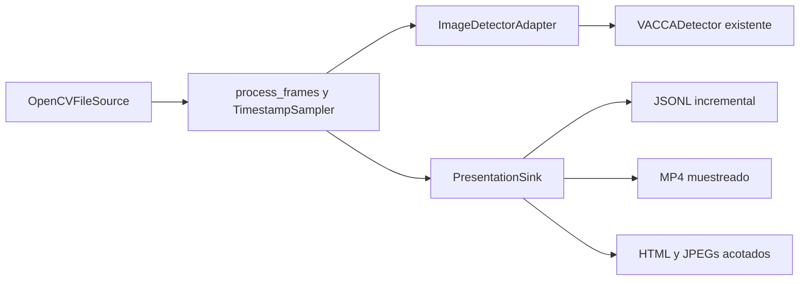

# Prototipo de detección de vacas en video

## Qué permite mostrar

Un video grabado se convierte en frames seleccionados por tiempo. El detector
YOLO de VACCA devuelve cajas y confianza. El comando genera una presentación HTML
local, un MP4 anotado y resultados JSONL por frame. No necesita backend,
PostgreSQL, R2, frontend, cámara, conexión a Internet durante la inferencia ni BCS.

La primera entrega está aislada en `feature/deteccion-video`, creada desde
`develop` en un worktree `IA-video`. La base usada es
`2024ec951c3d54995d6c3147773066b517232199`. Los contratos y el código de `/detect`
y `/bcs` no cambian. No hay tracking, identificación individual ni condición
corporal: el número indica **vacas visibles en un frame**, no animales únicos.

## Por qué esta opción

La alternativa de archivo permite demostrar detección real y repetir pruebas sin
depender de avances de los otros repositorios. Mantiene fuente, detección y salida
separadas; luego se puede incorporar una fuente de cámara o un consumidor de
resultados sin trasladar reglas del dominio a la IA.

No conviene comenzar enviando una solicitud HTTP por cada frame del navegador:
eso sumaría transporte, sincronización y cambios en tres repositorios antes de
validar el detector sobre video. Tampoco se incorpora un sistema de colas o un
servidor nuevo para esta demostración local.

## Preparar el entorno

Desde la carpeta del worktree, utilizar **Python 3.13 en Windows x64**, que es la
plataforma de los locks actuales del proyecto:

```powershell
py -3.13 -m venv .venv
.venv\Scripts\python -m pip install --require-hashes -r requirements-cpu.txt -r requirements-api.txt -r requirements-dev.txt
.venv\Scripts\python -m pip install --no-deps --no-build-isolation -e ".[yolo,api]"
```

OpenCV ya forma parte del lock CPU: el prototipo no cambia versiones ni incorpora
otro motor de IA. Los scripts también funcionan desde el checkout sin instalación
editable, siempre que sus dependencias estén instaladas. No se deben reutilizar
los hashes de estos locks en otra plataforma sin regenerarlos deliberadamente.

## Ejecutar con un video real

```powershell
.venv\Scripts\python scripts/process_video.py "D:\Videos\vacas.mp4" --output outputs/video/primer-avance
```

Abrir `outputs/video/primer-avance/report.html` con doble clic. No requiere un
servidor: los datos y las imágenes se leen mediante archivos locales. Para
compartirlo, enviar la **carpeta completa**, no únicamente el HTML.

La salida debe ser una carpeta nueva. El comando rechaza una carpeta existente
para no sobrescribir resultados de otra ejecución. Si se omite `--output`, se
crea una carpeta con identificador único dentro de `outputs/video`.

Configuración de la demostración predeterminada:

| Parámetro | Valor | Propósito |
| --- | --- | --- |
| `--sample-fps` | 5 | Frecuencia objetivo de análisis, sin duplicar frames. |
| `--max-frames` | 300 | Limita el trabajo a 300 frames analizados. `0` procesa hasta el final. |
| `--confidence` | 0.25 | Mismo valor inicial que el detector existente. |
| `--preview-limit` | 120 | Máximo de JPEG conservados para el explorador HTML; entre 1 y 1000. |
| `--model` | Pesos versionados de VACCA | Solo carga un archivo local; no descarga modelos automáticamente. |
| `--no-video` | Desactivado | Omite MP4; conserva presentación y JSONL si no se dispone de codec. |

Para procesar todo un archivo manteniendo acotado el explorador:

```powershell
.venv\Scripts\python scripts/process_video.py "D:\Videos\vacas.mp4" --output outputs/video/completo --sample-fps 5 --max-frames 0 --preview-limit 120
```

`Ctrl+C` cancela el procesamiento. Una vez iniciada la escritura de resultados,
se intenta cerrar el MP4 y generar un informe parcial con estado `cancelled`.
Errores de decodificación o detección se registran como `failed`, nunca como una
ejecución exitosa. Una terminación forzada del proceso o un disco lleno pueden
impedir cerrar correctamente los archivos; en ese caso no hay garantía de un
informe final utilizable.

## Demostración reproducible sin video de campo

El repositorio incluye una fotografía pública de vaca. Este comando genera un
clip **sintético** de ocho segundos: fondo vacío, una copia de la foto y dos
copias. No contiene movimiento real de animales ni sirve para medir calidad en
campo. La inferencia posterior sí usa el modelo real, no detecciones simuladas.

```powershell
.venv\Scripts\python scripts/make_video_fixture.py
.venv\Scripts\python scripts/process_video.py outputs/fixtures/synthetic-cow.mp4 --output outputs/video/demo-sintetica --sample-fps 5 --max-frames 0
```

El clip muestra una advertencia en la imagen. La procedencia de la fotografía está
documentada en [el reporte del baseline](../reports/baseline-inference-2026-08-02.md).
Ni el generador ni el procesador afirman que el detector siempre vaya a producir
exactamente cero, una y dos detecciones: eso se comprueba mirando la salida real.

## Artefactos

```text
outputs/video/<ejecución>/
├── report.html        Explorador offline, reproducción y resumen
├── summary.json       Estado, configuración, modelo y métricas
├── summary.js         Datos locales para report.html
├── detections.jsonl   Una línea JSON por frame analizado
├── frames.js          Índice acotado de la vista previa
├── frames/            JPEG anotados, hasta preview-limit
└── annotated.mp4      Todos los frames analizados, sin audio (opcional)
```

El MP4 es un video **muestreado** a frecuencia constante, reducido a un ancho
máximo de 960 píxeles para presentación. No conserva el audio ni todos los frames
originales. Su duración es aproximada, especialmente en archivos de FPS variable.
Los tiempos del JSONL y del explorador son la referencia temporal, no el tiempo
de reproducción del MP4. Se utiliza `mp4v`; algunos navegadores no lo reproducen,
por eso el HTML navega JPEGs y no depende del codec de video del navegador.

El JSONL conserva cajas en las dimensiones originales. El HTML/MP4 muestra las
cajas escaladas a la imagen de presentación. No se reutilizan cajas antiguas
encima de un frame nuevo.

Cada resultado incluye `schema_version`, `processing_id`, `model_version`,
`frame_index`, `timestamp_ms`, `timestamp_source`, dimensiones, conteo,
confianzas, cajas y tiempo de inferencia. `summary.json` incluye el SHA-256 de los
pesos, umbral, fuente, muestreo, motivo de finalización y resultados agregados.

Si `stop_reason` es `frame_limit`, se completó la vista parcial solicitada; no se
afirma que se haya procesado todo el archivo. Con `end_of_source`, el decodificador
alcanzó el final sin detectar un corte anticipado significativo. El total de frames
declarado por algunos codecs es aproximado y OpenCV no distingue todos los casos
de archivo dañado de un fin de archivo; comprobar los clips de destino.

## Arquitectura y límites de rendimiento



- `pipeline.py` no importa OpenCV, Torch, FastAPI ni BCS. Trabaja con un iterable
  de frames y contratos de detector/salida; sus pruebas no necesitan un modelo.
- `source.py` abre un archivo local y libera el decodificador aun ante errores.
  Usa tiempos de OpenCV normalizados al primer frame. Si no avanzan o son
  inválidos, estima tiempos a partir de los FPS e informa `fps_fallback`.
- `detector.py` instancia una sola vez el detector existente y adapta frames BGR a
  JPEG con calidad 95. La codificación tiene un costo y puede introducir pequeñas
  diferencias frente a la imagen original; una entrada directa en memoria sería
  una optimización posterior, con pruebas de equivalencia.
- `output.py` escribe JSONL y MP4 incrementalmente. Conserva como archivos solo
  los primeros `preview_limit` JPEGs y no retiene todo el historial en Python.
- El proceso es secuencial: no comparte el singleton de la API ni incorpora
  concurrencia sobre el modelo. Usa un proceso separado y no necesita puertos.

La memoria del procesador no crece con la cantidad de frames. El JSONL y el MP4
sí crecen en disco. El navegador carga como máximo el índice de la vista previa
configurada. La decodificación recorre el archivo aunque no se analicen todos sus
frames; muestrear reduce inferencias, no necesariamente el costo de decodificar.

`processing_fps` mide frames analizados / tiempo del bucle, incluyendo lectura,
codificación, detección y escritura. Excluye carga inicial del modelo, que se
registra por separado. `mean_inference_ms` mide el tramo informado por el detector,
incluida su primera inferencia; no equivale a latencia de cámara ni a un SLA.

## Pruebas y regresión

```powershell
.venv\Scripts\python -m pytest tests/test_video_pipeline.py tests/test_video_io.py -q
.venv\Scripts\python -m pytest --disable-warnings --strict-config --strict-markers -W error::DeprecationWarning -q
node --test tests/ui_controller.test.js tests/video_report.test.js
.venv\Scripts\python -m ruff check src scripts tests
git diff --check
```

Las pruebas nuevas cubren muestreo temporal irregular, configuración inválida,
cero/varias detecciones, ausencia de conteo único, finalización por límite,
cancelación, fallas parciales, liberación del decodificador, no sobrescritura,
vista previa acotada y un recorrido de codec real con detector de prueba.
Ese recorrido no sustituye la ejecución explícita con los pesos reales.

La ejecución realizada, las limitaciones de la suite completa y las
sobredetecciones observadas están en el
[reporte de verificación](../reports/video-prototype-2026-09-29.md).
La suite BCS escribe numerosos checkpoints temporales: en la máquina de esta
revisión agotó el espacio disponible. Para verificar primero la detección sin
esos escenarios, usar la selección acotada documentada en el reporte; no
confundirla con una aprobación de todos los tests del repositorio.

## Escalar sin mezclar el trabajo del equipo

1. **Primera presentación:** ejecutar este CLI, mostrar el HTML y compartir el
   JSONL/MP4 y la configuración. Repetir con un video real antes de afirmar calidad.
2. **Integración web:** backend crea un trabajo autorizado y registra su estado;
   un worker invoca el núcleo de procesamiento y publica resultados. Frontend
   consume el estado/resultados. Conservar los esquemas versionados o adaptar
   explícitamente el contrato acordado; el CLI no es un gestor de trabajos durable.
3. **Cámara:** implementar una fuente con frames y tiempos monotónicos, cola
   acotada, descarte de atraso y reconexión. Un iterable compatible no resuelve por
   sí solo transporte, tiempo real ni sincronización con el navegador.
4. **Tracking/identificación:** incorporar como funciones separadas únicamente si
   se pide conteo único o asociación con animales/RFID. BCS sigue siendo independiente.

Antes del PR, actualizar referencias y comparar la rama con `develop`. No mezclar
los cambios de otros repositorios en este prototipo. Este cambio no añade ni aplica
migraciones. Mantener videos, fotos y salidas fuera de Git; `outputs/` está ignorado.
